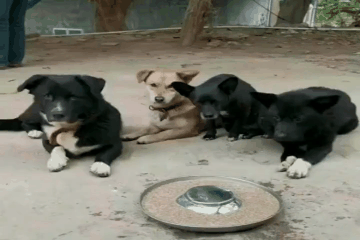
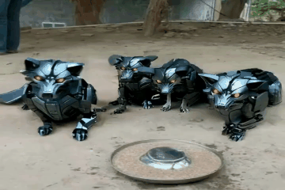

# 🎬IMAGEdit🎬:Let Any Subject transform
)
)
)
<!-- 
 -->

## 📅 Release

- [2025/10/1] 🎉 We launch the [project page](https://muzishen.github.io/IMAGEdit/) of IMAGEdit.

## 💡 Introduction

We presented IMAGEdit, a training free framework for video editing with any number of subjects that changes designated categories. IMAGEdit provides robust multimodal conditioning and precise mask motion sequences through two key components, a prompt guided multimodal alignment module and a prior based mask retargeting module. By leveraging the understanding and generation capabilities of large pretrained models, these components produce aligned multimodal signals and time consistent masks that effectively remedy insufficient prompt side conditioning and overcome mask boundary entanglement in crowded scenes. The framework then conditions a pretrained mask driven video generator to synthesize the edited video. IMAGEdit is plug and play with a wide range of mask driven backbones and consistently improves overall performance. Extensive experiments on the new multi subject benchmark MSVBench verify that IMAGEdit surpasses state of the art methods. Code, dataset, and weights will be released to support further research.
## 🔥 DatasetDemo
## 🔥 Examples

<table align="center">
  <tr>
    <td align="center" style="width: 300px; padding-right: 15px;">
      
    </td>
    <td align="center" style="width: 300px; padding-left: 15px;">
      
    </td>
    <td style="position: relative; width: 2px; padding: 0;">
      

    </td> <!-- 固定分界线位置 -->
    <td align="center" style="width: 300px; padding-right: 15px;">
      
    </td>
    <td align="center" style="width: 300px; padding-left: 15px;">
      
    </td>
  </tr>
  <tr>
    <td colspan="2" align="center" style="padding: 10px;">Three [People -> Super Mario] sitting in car backseat.</td>
    <td style="padding: 0;"></td> <!-- 空白单元格 -->
    <td colspan="2" align="center" style="padding: 10px;">Four [People -> Robots] standing on football court.</td>
  </tr>
</table>

<table align="center">
  <tr>
    <td align="center" style="width: 300px; padding-right: 15px;">
      
    </td>
    <td align="center" style="width: 300px; padding-left: 15px;">
      
    </td>
    <td style="position: relative; width: 2px; padding: 0;">
      

    </td> <!-- 固定分界线位置 -->
    <td align="center" style="width: 300px; padding-right: 15px;">
      
    </td>
    <td align="center" style="width: 300px; padding-left: 15px;">
      
    </td>
  </tr>
  <tr>
    <td colspan="2" align="center" style="padding: 10px;">Four [Hungry Dogs -> Robot Wolves] surrounding a bowl of food outdoors.</td>
    <td style="padding: 0;"></td> <!-- 空白单元格 -->
    <td colspan="2" align="center" style="padding: 10px;">A group of [People -> Astronauts] practicing boxing in a fitness studio.</td>
  </tr>
</table>

<table align="center">
  <tr>
    <td align="center" style="width: 300px; padding-right: 15px;">
      
    </td>
    <td align="center" style="width: 300px; padding-left: 15px;">
      
    </td>
    <td style="position: relative; width: 2px; padding: 0;">
      

    </td> <!-- 固定分界线位置 -->
    <td align="center" style="width: 300px; padding-right: 15px;">
      
    </td>
    <td align="center" style="width: 300px; padding-left: 15px;">
      
    </td>
  </tr>
  <tr>
    <td colspan="2" align="center" style="padding: 10px;">A team of [Men -> Spider-Men] rowing together on a river.</td>
    <td style="padding: 0;"></td> <!-- 空白单元格 -->
    <td colspan="2" align="center" style="padding: 10px;">Eight [Hurdlers -> Iron Men] leap mid-race over purple hurdles.</td>
  </tr>
</table>

