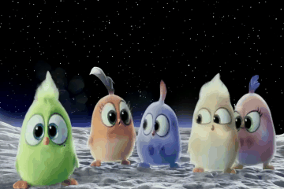

# 🎬IMAGEdit🎬: Let Any Subject Transform

[](https://muzishen.github.io/IMAGEdit/)
[](https://muzishen.github.io/IMAGEdit/)
[](https://muzishen.github.io/IMAGEdit/)
[](https://github.com/XWH-A/IMAGEdit)

---

**IMAGEdit: Let Any Subject Transform [[Project](https://muzishen.github.io/IMAGEdit/)] [[Code](https://github.com/XWH-A/IMAGEdit)]** <br />  
[Fei Shen](https://muzishen.github.io/), [Weihao Xu](https://github.com/XWH-A/), [Rui Yan](https://ruiyan1995.github.io/), [Dong Zhang](https://dongzhang89.github.io/), [Xiangbo Shu](https://shuxb104.github.io/), [Jinhui Tang](https://scholar.google.com/citations?user=ByBLlEwAAAAJ&hl=en) <br />


---

## 📅 Release
- [2025/10/01] 🎉 We launch the [project page](https://muzishen.github.io/IMAGEdit/) of IMAGEdit.

---

## 🚀 Key Features
1. **Training-Free & Plug-and-Play**: IMAGEdit requires no additional training and can be seamlessly integrated into existing mask-driven video editing backbones.  
2. **Prompt-Guided Multimodal Alignment**: Aligns user prompts with visual semantics to ensure accurate subject replacement and category transformation.  
3. **Prior-Based Mask Retargeting**: Leverages depth and temporal priors to generate smooth, time-consistent mask motion sequences, even in crowded scenes.  
4. **Robust Any-Subject Editing**: Supports flexible editing for single or multiple subjects while preserving background and maintaining temporal coherence across frames.  

---

## 💡 Introduction
We present **IMAGEdit**, a training-free framework for video editing with any number of subjects that changes designated categories. IMAGEdit provides robust multimodal conditioning and precise mask motion sequences through two key components:  
- a **prompt-guided multimodal alignment module** and  
- a **prior-based mask retargeting module**.  

By leveraging the understanding and generation capabilities of large pretrained models, these components produce aligned multimodal signals and time-consistent masks that effectively remedy insufficient prompt-side conditioning and overcome mask boundary entanglement in crowded scenes. The framework then conditions a pretrained mask-driven video generator to synthesize the edited video.  

IMAGEdit is **plug-and-play** with a wide range of backbones and consistently improves overall performance. Extensive experiments on the new **multi-subject benchmark MSVBench** verify that IMAGEdit surpasses state-of-the-art methods.  

---

## 🔥 Examples

<table align="center">
  <tr>
    <td align="center" width="450">
      
      
      <br>
      <sub>Three [People -> Super Mario] sitting in car backseat.</sub>
    </td>
    <td align="center" width="450">
      
      
      <br>
      <sub>Four [People -> Robots] standing on football court.</sub>
    </td>
  </tr>
  <tr>
    <td align="center" width="450">
      
      
      <br>
      <sub>Four [Hungry Dogs -> Robot Wolves] surrounding a bowl of food outdoors.</sub>
    </td>
    <td align="center" width="450">
      
      
      <br>
      <sub>A group of [People -> Astronauts] practicing boxing in a fitness studio.</sub>
    </td>
  </tr>
  <tr>
    <td align="center" width="450">
      
      
      <br>
      <sub>A team of [Men -> Spider-Men] rowing together on a river.</sub>
    </td>
    <td align="center" width="450">
      
      
      <br>
      <sub>Eight [Hurdlers -> Iron Men] leap mid-race over purple hurdles.</sub>
    </td>
  </tr>
</table>

### 🌈Multi-Scenario Applications
<table align="center">
  <tr>
    <td align="center" width="450">
      
      
      <br>
      <sub>Automn Forest -> Winter Forest</sub>
    </td>
    <td align="center" width="450">
      
      
      <br>
      <sub>Snowy Forest -> Lunar Surface</sub>
    </td>
  </tr>
  <tr>
    <td align="center" width="450">
      
      
      <br>
      <sub>The Eiffel Tower -> The Space Needle</sub>
    </td>
    <td align="center" width="450">
      
      
      <br>
      <sub>Glasses -> Sunglasses</sub>
    </td>
  </tr>
  <tr>
    <td align="center" width="450">
      
      
      <br>
      <sub>Left -> Ultraman; Right -> Robot</sub>
    </td>
    <td align="center" width="450">
      
      
      <br>
      <sub>Left -> Gorilla; Right -> Polar Bear</sub>
    </td>
  </tr>
  <tr>
    <td align="center" width="450">
      
      
      <br>
      <sub>Left -> Lightning McQueen; Right -> Yellow Cartoon Porsche</sub>
    </td>
    <td align="center" width="450">
      
      
      <br>
      <sub>Left -> Gorilla; Right -> Polar Bear</sub>
    </td>
  </tr>
  
</table>
<table align="center">
  <tr>
    <td align="center" width="280">
      
      <br>
      <sub>Original Video</sub>
    </td>
    <td align="center" width="280">
      
      <br>
      <sub>Turn 1: Horse Riders -> Gokus</sub>
    </td>
    <td align="center" width="280">
      
      <br>
      <sub>Turn 2: The two above (Gokus -> Iron-Men)</sub>
    </td>
  </tr>
</table>
<table align="center">
  <table align="center">
  <tr>
    <td align="center" width="225">
      
      <br>
      <sub>Original Video</sub>
    </td>
    <td align="center" width="225">
      
      <br>
      <sub>Add Glasses    </sub>
    </td>
    <td align="center" width="225">
      
      <br>
      <sub>Change Face To "Durant"</sub>
    </td>
    <td align="center" width="225">
      
      <br>
      <sub>Change Face To "James"</sub>
    </td>
  </tr>
  <tr>
    <td align="center" width="225">
      
      <br>
      <sub>Original Video</sub>
    </td>
    <td align="center" width="225">
      
      <br>
      <sub>Remove Glasses</sub>
    </td>
    <td align="center" width="225">
      
      <br>
      <sub>Plaid Shirt -> Business Suit</sub>
    </td>
    <td align="center" width="225">
      
      <br>
      <sub>Plaid Shirt -> Hawaiian Shirt</sub>
    </td>
  </tr>
</table>
</table>


## 🔧 Requirements

- Python >= 3.8 (Recommend to use [Anaconda](https://www.anaconda.com/download/#linux) or [Miniconda](https://docs.conda.io/en/latest/miniconda.html))
- [PyTorch >= 2.0.0](https://pytorch.org/)
- cuda==11.8

```bash
conda create --name IMAGDressing python=3.8.10
conda activate IMAGDressing
pip install -U pip

# Install requirements
pip install -r requirements.txt
```

---


## 🌐 Download Models
You can download our models from [HuggingFace](https://huggingface.co/feishen29/IMAGDressing) or [百度云](https://pan.baidu.com/s/1-69aFUjtrsGnD0OlU0dMzQ?pwd=imag).  You can download the other component models from the original repository, as follows.
- [stabilityai/sd-vae-ft-mse](https://huggingface.co/stabilityai/sd-vae-ft-mse).
- if train: [stable-diffusion-v1-5/stable-diffusion-v1-5](https://huggingface.co/stable-diffusion-v1-5/stable-diffusion-v1-5), if test: [SG161222/Realistic_Vision_V4.0_noVAE](https://huggingface.co/SG161222/Realistic_Vision_V4.0_noVAE).
- [h94/IP-Adapter-FaceID](https://huggingface.co/h94/IP-Adapter-FaceID).
- [lllyasviel/control_v11p_sd15_openpose](https://huggingface.co/lllyasviel/control_v11p_sd15_openpose).


## 🎉 How to Use

### <span style="color:red">Important Reminder</span>


```sh
python inference_IMAGdressing.py --cloth_path [your cloth path]
```


## 🙏 Acknowledgement
We thank the contributors of [IDM-VTON](https://github.com/yisol/IDM-VTON), [MagicClothing](https://github.com/ShineChen1024/MagicClothing), [IP-Adapter](https://github.com/tencent-ailab/IP-Adapter), [ControlNet](https://github.com/lllyasviel/ControlNet), [T2I-Adapter](https://github.com/TencentARC/T2I-Adapter), and [AnimateDiff](https://github.com/guoyww/AnimateDiff) for their open research and inspiration.  

The IMAGEdit code is released for **academic use**. All released checkpoints are restricted to research purposes. Users must comply with local laws and take responsibility for their own generations. The authors disclaim liability for misuse.  

---

## 📝 Citation
If you find IMAGEdit useful for your research, please cite:  

```bibtex
@article{shen2025imagedit,
  title={IMAGEdit: Let Any Subject Transform},
  author={Shen, Fei and Xu, Weihao and Yan, Rui and Zhang, Dong and Shu, Xiangbo and Tang, Jinhui},
  journal={arXiv preprint arXiv:2509.xxxxx},
  year={2025}
}

```

## 🕒 TODO List
- [x] Gradio demo
- [x] Inference code
- [x] Model weights (512 sized version)
- [x] Support inpaint
- [ ] Model weights (More higher sized version)
- [x] Paper
- [x] Evaluate metric code
- [x] IGPair dataset
- [x] Training code
- [ ] Video Dressing
- [ ] Others, such as User-Needed Requirements


## 👉 **Our other projects:**  
- [IMAGEdit](https://github.com/XWH-A/IMAGEdit): Training-Free Controllable Video Editing with Consistent Object Layout.  [可控多目标视频编辑]
- [IMAGDressing](https://github.com/muzishen/IMAGDressing): Controllable dressing generation. [可控穿衣生成]
- [IMAGGarment](https://github.com/muzishen/IMAGGarment): Fine-grained controllable garment generation.  [可控服装生成]
- [IMAGHarmony](https://github.com/muzishen/IMAGHarmony): Controllable image editing with consistent object layout.  [可控多目标图像编辑]
- [IMAGPose](https://github.com/muzishen/IMAGPose): Pose-guided person generation with high fidelity.  [可控多模式人物生成]
- [RCDMs](https://github.com/muzishen/RCDMs): Rich-contextual conditional diffusion for story visualization.  [可控故事生成]
- [PCDMs](https://github.com/tencent-ailab/PCDMs): Progressive conditional diffusion for pose-guided image synthesis. [可控人物生成]
- [V-Express](https://github.com/tencent-ailab/V-Express/): Explores strong and weak conditional relationships for portrait video generation. [可控数字人生成]
- [FaceShot](https://github.com/open-mmlab/FaceShot/): Talkingface plugin for any character. [可控动漫数字人生成]
- [CharacterShot](https://github.com/Jeoyal/CharacterShot): Controllable and consistent 4D character animation framework. [可控4D角色生成]
- [StyleTailor](https://github.com/mahb-THU/StyleTailor): An Agent for personalized fashion styling. [个性化时尚Agent]
- [SignVip](https://github.com/umnooob/signvip/): Controllable sign language video generation. [可控手语生成]


## 📨 Contact
If you have any questions, please feel free to contact with me at xxx or shenfei29@nus.edu.sg.
